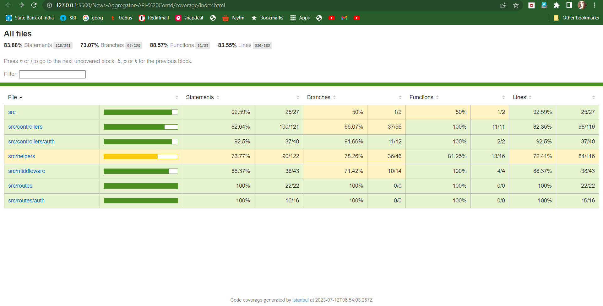
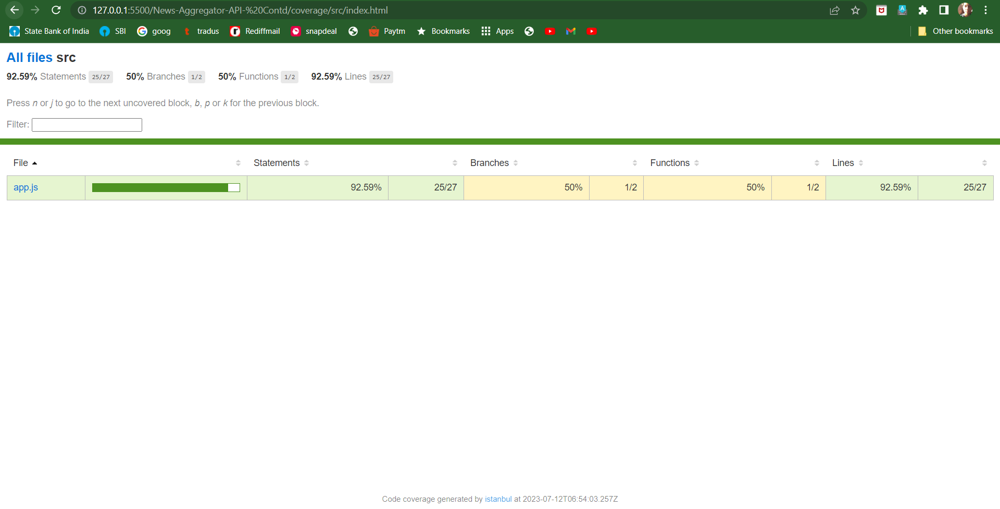
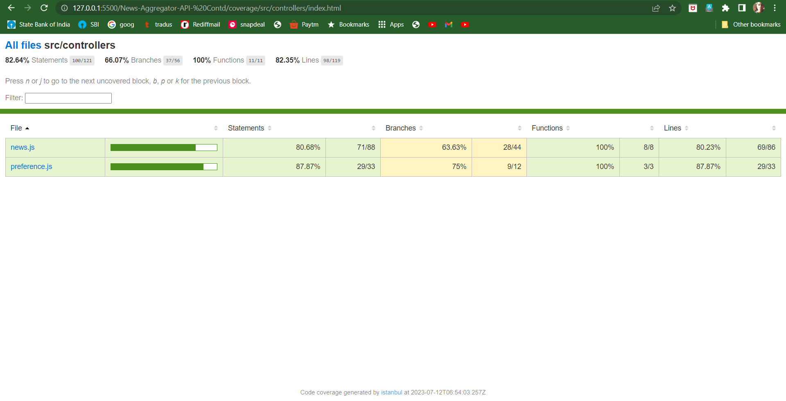
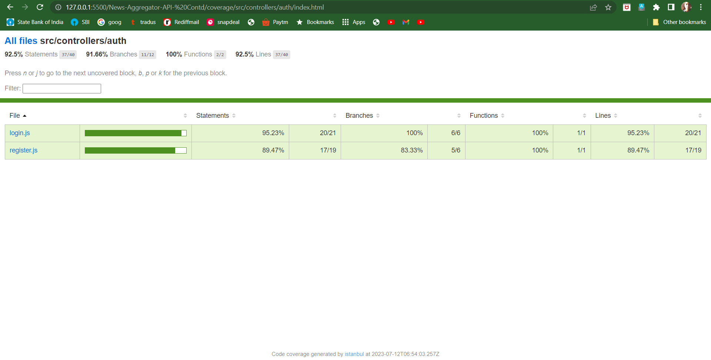
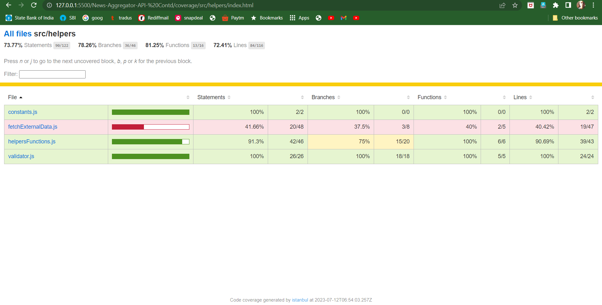
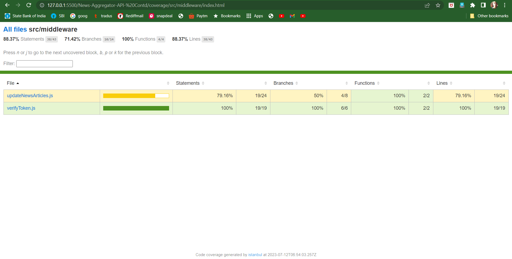

# News-Aggregator-API-Cotd.

On top of the original [News-Aggregator-API](https://github.com/katiyarkartik0/News-Aggregator-API) project, which included
* validation and sanitization for user registration, by adding email validation.
* Optimize performance by implementing caching
* Error handling, ensuring that appropriate error messages are returned for different types of errors (e.g., validation errors, authentication errors, authorization errors, and server errors).

In this revision we have implemented the following
* Unit testing by using testing framework ```mocha``` and assertion framework ```chai``` has been implemented to test API endpoints and helper functions, focusing on testing input validation and proper functioning of CRUD operations.
* We made sure to achieve good test coverage using a coverage tool ```nyc```. Below are the results of the test coverage.









